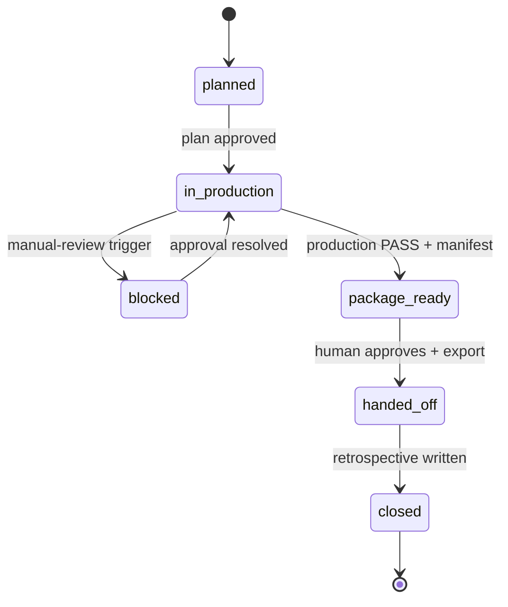
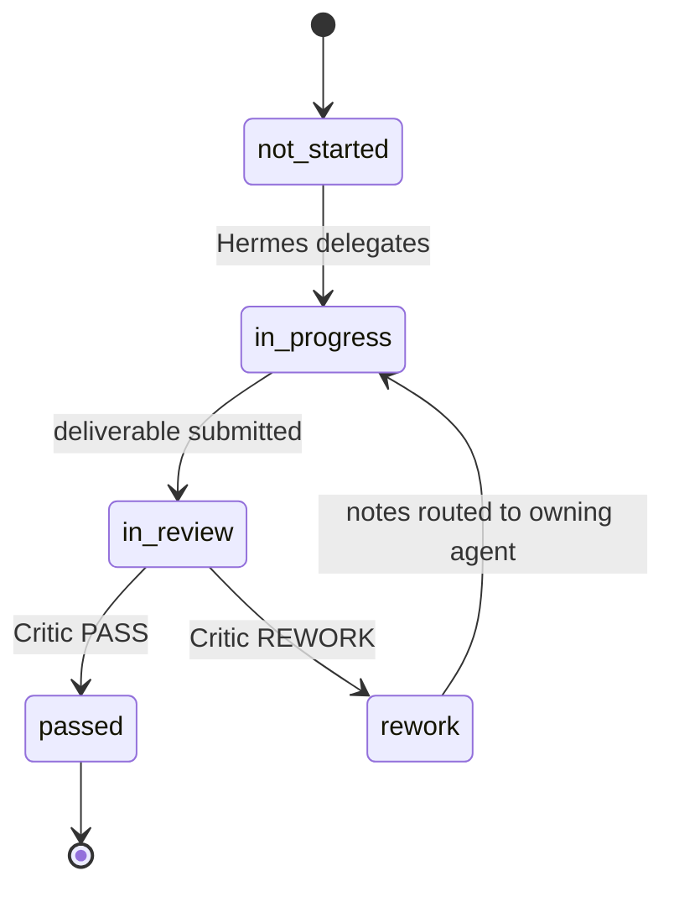

# Workflow and State

Status: **Drafted**

## 1. Purpose

Workflow Core answers two questions for every episode: **where are we** and
**what can happen next**. It owns the per-episode state machine, revision
tracking, and recovery. It holds no creative opinion — that is Hermes, the
specialists, and Critic.

## 2. Episode State Machine

```text
planned
  -> in_production        (Hermes plan approved, state initialized)
in_production
  -> blocked              (a manual-review trigger fires)
  -> package_ready        (production stage passes Critic; manifest written)
blocked
  -> in_production        (approval resolved)
package_ready
  -> handed_off           (Creative Director approves; package exported for DaVinci)
handed_off
  -> closed               (retrospective + metrics snapshot written)
```



## 3. Stage State Machine (per stage)

Stages, in order: `research -> story -> visual -> production`.

```text
not_started -> in_progress          (Hermes delegates)
in_progress -> in_review            (agent submits deliverable)
in_review   -> passed               (Critic PASS)
in_review   -> rework               (Critic REWORK)
rework      -> in_progress          (Hermes routes notes to owning agent)
```



A stage may not enter `in_progress` until the previous stage is `passed`
(exception: independent asset generations within `production` may run in
parallel once the production stage itself is `in_progress`).

## 4. The Critic / Rework Loop

```text
Research  -> Critic -> (PASS -> Story    | REWORK -> Research)
Story     -> Critic -> (PASS -> Visual   | REWORK -> Story)
Visual    -> Critic -> (PASS -> Production| REWORK -> Visual)
Production-> Critic -> (PASS -> Human     | REWORK -> Production)
Human review -> (approve -> handed_off | notes -> targeted stage rework)
```

- Critic returns exactly one decision per review.
- A REWORK request carries `{description, reason, severity, owning_agent}` per
  item. Hermes routes it to `owning_agent`.
- The owning agent revises **only** the flagged items.
- `StageState.revision_count` increments on each REWORK.
- Re-review is mandatory: a stage cannot reach `passed` without a fresh Critic
  PASS for the current deliverable.

### Revision ceiling and escalation

- **Threshold:** `revision_count >= 3` on a single stage -> Critic escalates to
  the Creative Director via Hermes; episode moves to `blocked` until the human
  gives direction.
  <!-- DECISION NEEDED: confirm threshold value (draft: 3) -->
- A human can override a Critic REWORK ("ship it as is") — recorded as an
  `Approval` with rationale.

## 5. Transition Table

| From (stage.status) | Event | To | Guard |
| --- | --- | --- | --- |
| research.not_started | `agent.delegated` | research.in_progress | previous episode state = in_production |
| research.in_progress | `stage.deliverable.submitted` | research.in_review | deliverable present |
| research.in_review | `critic.pass` | research.passed | Critic Feedback row with decision=pass |
| research.in_review | `critic.rework` | research.rework | Feedback row with items[] |
| research.rework | `agent.delegated` | research.in_progress | revision_count < ceiling |
| research.rework | ceiling reached | (episode) blocked | revision_count >= ceiling |
| story.not_started | `agent.delegated` | story.in_progress | research.passed |
| ... | ... | ... | (same shape for story, visual, production) |
| production.in_review | `critic.pass` | production.passed | + package manifest written |
| production.passed | `episode.package.exported` | (episode) package_ready | manifest + all shots approved |

## 6. Recovery

Every transition is written in a single SQLite transaction together with its
event row. On restart, Workflow Core:

1. Loads each non-`closed` episode's `Episode.status` and all `StageState` rows.
2. For any stage in `in_progress` whose owning agent has no live task, marks it
   resumable and re-delegates from the last completed sub-step.
3. For any capability call with a `capability.call.started` event but no
   completed/failed event, marks it `unknown` and re-queues or asks Hermes to
   retry (idempotency via the call's request hash — a duplicate generation is
   detected and the earlier result reused where possible).
4. Never advances a stage on recovery; only restores it to a consistent
   in-progress or review state.

Invariant: a crash at any point leaves the episode in a state from which Hermes
can continue without losing an already-produced, already-registered asset.

## 7. Concurrency

- Multiple episodes: independent state rows, independent budgets, independent
  event streams. No global lock.
  <!-- ponytail: single-process, per-episode in-memory lock. Move to row-level DB locks only if multi-process is ever needed. -->
- Within an episode: stages are sequential. Within `production`, asset
  generations for different shots may run concurrently up to a configured limit.
- A slow/failed provider call is scoped to its episode+stage.

## 8. What Workflow Core Exposes

- `get_episode_state(episode_id)` -> episode status + per-stage status, owner,
  revision_count.
- `next_actions(episode_id)` -> the set of legal next transitions.
- `resumable_episodes()` -> episodes with in-flight work after a restart.

## 9. Open Questions

- Revision ceiling value (draft 3).
- Whether human review after `production PASS` is a formal stage in the machine
  or an approval gate on `package_ready -> handed_off` (current design: the
  latter).
- Whether `blocked` needs sub-reasons or the linked `Approval.trigger` is enough
  (current design: the linked Approval is enough).
