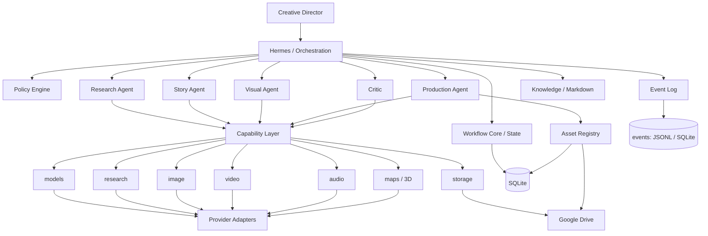
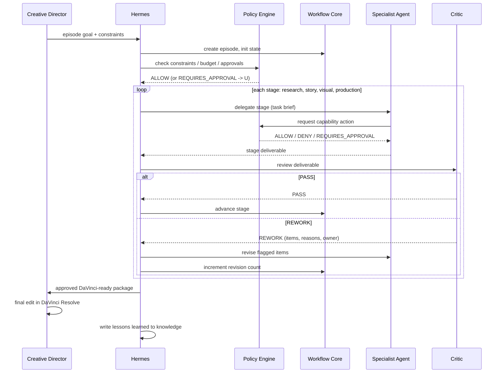
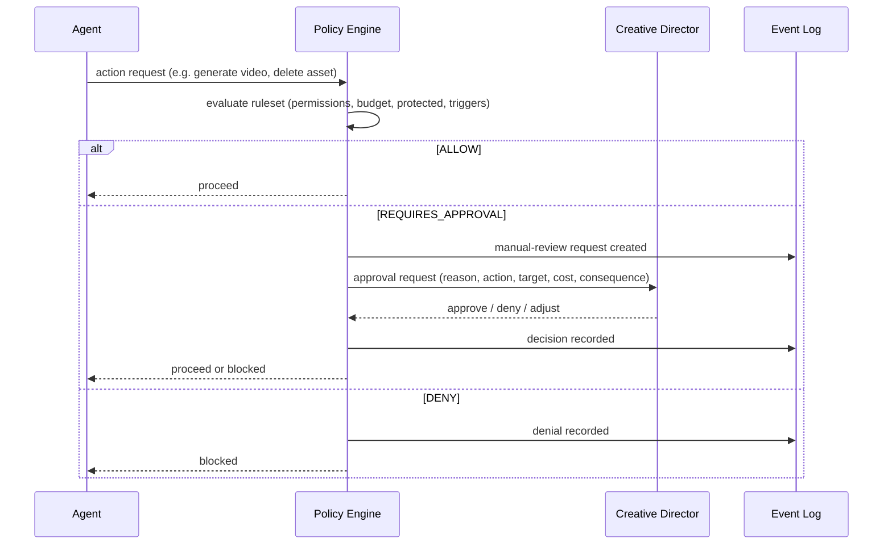

# Nomad Dimension Architecture

Status: **Drafted** · *Target architecture — not built. Current system: `../AS_BUILT.md`.*

## 1. Architecture Summary

Nomad Dimension is a layered, orchestrator-first system running on one machine.
Hermes owns planning and delegation. Policy Engine and Workflow Core own "what is
allowed" and "where are we". Specialist agents do the work by requesting
capabilities. Capability adapters select providers. All durable state is local:
SQLite for relationships and workflow, Markdown for knowledge, YAML for config,
Google Drive for heavy binaries.

```text
        YOU (Creative Director)
              |
              v
           HERMES
              |
     +--------+---------+
     v                  v
 POLICY ENGINE     WORKFLOW CORE
     |                  |
     +--------+---------+
              v
  RESEARCH / STORY / VISUAL / PRODUCTION  (specialist agents)
              |
              v
           CRITIC  --> REWORK back to Hermes / PASS forward
              |
              v
     DaVinci-ready package  --> YOU --> DaVinci Resolve

Capability layer:  models | research | image | video | audio | maps | storage
Data layer:        SQLite | Markdown | YAML | JSON | Google Drive
```

## 2. Component Diagram



## 3. Layer Responsibilities

| Layer | Owns | Does NOT own |
| --- | --- | --- |
| Intelligence (Hermes + agents) | Planning, delegation, the intellectual work of each stage | Permissions, budget accounting, provider selection |
| Core (Policy Engine + Workflow Core) | What is allowed, where each episode is, recovery | Creative decisions, provider calls |
| Capability | Typed request/response contract per ability, cost/latency recording | Which specific vendor (that is the adapter), business rules |
| Provider adapters | Talking to one vendor, mapping errors, reporting cost | Anything a second provider would have to re-implement differently |
| Data | Durable state, knowledge, config, binaries | Logic |

Rule: agents request capabilities; adapters pick providers. A provider swap is a
new adapter plus a config change. Nothing above the capability line changes.

## 4. Runtime Boundary

### Core (must stay Nomad-owned)

- Hermes orchestration and escalation logic
- Policy Engine ruleset and evaluation
- Workflow Core state machine and recovery
- Domain model and asset registry
- Capability interface definitions
- Event log
- Knowledge store

### Replaceable / external

- Provider adapters (LLM, research, image, video, audio, maps)
- Storage adapter (Google Drive today)
- Optional MCP servers
- DaVinci Resolve (external, human-operated)
- Optional FastAPI/CLI front end

## 5. Episode Production Flow



This sequence is a **fixed workflow**, not a model-directed one: the stage order
and the Critic gates are deterministic code in Workflow Core (ADR-013). Within a
stage, the owning agent is a bounded task executor with a step budget
(`07_AGENT_SPECS.md` §B). Hermes prepares delegation and state under a per-episode
lock, but provider generation runs outside it, so a slow provider on one episode
does not block status queries or work on another episode.

## 6. Approval Flow



Rules:

- The decision is made before execution.
- Policy is deterministic code, never an LLM call.
- Unknown action or missing rule -> DENY (fail closed).
- Every decision is logged with inputs and reason code.

## 7. Critic as a Cross-Cutting Gate

Critic runs after every stage:

```text
Research -> Critic -> Story -> Critic -> Visual -> Critic -> Production -> Critic -> Human
```

Critic never edits work and never approves its own output. It returns PASS or a
structured REWORK. Repeated REWORK on the same stage past a threshold escalates
to the human. Stage rubrics live in `08_WORKFLOW_AND_STATE.md` and
`13_VISUAL_PHILOSOPHY.md`.

## 8. Event Model

Every meaningful action emits a structured event linked to `episode_id` (and,
where relevant, `segment_id` / `shot_id` / `asset_id`).

```text
# Episode / workflow
episode.created
episode.plan.created
stage.started
stage.deliverable.submitted
stage.advanced
stage.revision.requested
episode.package.exported
episode.closed

# Agent
agent.delegated
agent.result
agent.escalated

# Critic
critic.review.started
critic.pass
critic.rework

# Policy / approval
policy.decision            (ALLOW | DENY | REQUIRES_APPROVAL + reason code)
approval.requested
approval.resolved          (approved | denied | adjusted)

# Capability
capability.call.started
capability.call.completed  (provider, cost, latency, outcome)
capability.call.failed

# Asset
asset.registered
asset.version.created
asset.protected.changed

# Knowledge
knowledge.lesson.appended
```

All events must be serializable and durable enough to reconstruct a per-episode
timeline.

## 9. Content Routing

Not every output goes everywhere. Each deliverable declares a kind:

```text
plan | research_package | script | shot_list | asset | package | review | escalation | error
```

| Kind | Stored in | Shown to human | Goes to Critic |
| --- | --- | --- | --- |
| plan | SQLite + Markdown | yes (approve) | no |
| research_package | SQLite + Markdown | on request | yes |
| script | SQLite + Markdown | on request | yes |
| shot_list | SQLite | on request | yes |
| asset | Drive + registry | thumbnails on request | yes (as part of package) |
| package | Drive + manifest | yes (approve) | yes |
| review | SQLite | yes | n/a |
| escalation | SQLite + notification | yes (action) | no |
| error | event log | yes if blocking | no |

## 10. Capability Layer

Each capability is a typed interface. Responsibilities of an adapter:

- accept the capability request contract
- call one provider
- map provider errors to the Nomad error taxonomy
- report provider, cost, latency, outcome
- support cancellation where the provider allows it

Prove each capability with one provider before adding a second. Interfaces and
per-capability contracts: `10_CAPABILITY_AND_PROVIDER_STRATEGY.md`.

## 11. Persistence Architecture

```text
repo/
  config/                 # YAML config, not secrets
  knowledge/              # Markdown channel knowledge + episode retrospectives
  workspace/
    <episode-id>/
      plan.md
      research/
      script/
      shot-list/
      package/            # local staging before Drive sync
  nomad.sqlite            # domain model, workflow state, asset registry
  events/                 # JSONL event logs (or events table in nomad.sqlite)
  .env                    # secrets, gitignored
```

Google Drive holds the heavy binaries; SQLite holds the pointers and metadata.
The store must protect against partial writes and never persist raw secrets.

## 12. Security Architecture

Security-sensitive behavior is centralized in the Policy Engine and the storage
boundary:

- Policy Engine classifies and authorizes every risky action.
- Protected/source/approved assets fail closed against destructive operations.
- External content is delimited and passed as data.
- The storage adapter and logger redact secrets.
- No agent calls a provider or touches Drive without going through a capability
  adapter, and no destructive action skips policy.

See `09_POLICY_AND_SAFETY_MODEL.md` and `19_RISK_REGISTER.md`.

## 13. Concurrency Model

- Multiple episodes may be in production at once; each has its own Workflow Core
  state row and its own budget accounting.
- Within an episode, stages are sequential (gated by Critic). Independent asset
  generations within the Production stage may run in parallel.
- A slow or failed provider call is isolated to its episode/stage and does not
  block others.
<!-- TODO: concrete concurrency limits, provider rate-limit handling -->

## 14. Future Cross-Platform / Scale Notes

- SQLite -> PostgreSQL: keep queries portable, migrations forward-only.
- Google Drive -> object storage: all access via the storage capability.
- In-process work -> job queue: long-running steps already emit start/complete
  events and hold no in-memory-only state.
- None of these require changing agents or the content model.
