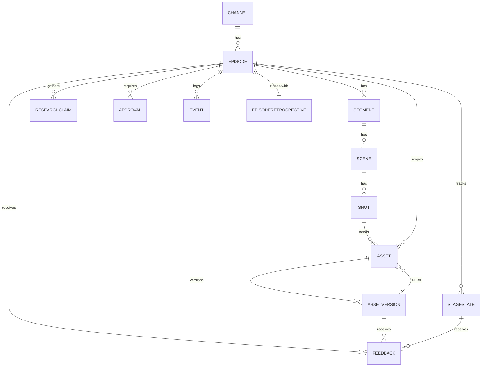

# Data Model

Status: **Drafted** (schema details flagged where a decision is pending)

## 1. Purpose

Freeze the content domain model so the creative system never has to be
redesigned. The model scales from a channel down to individual assets and their
versions, and supports many episodes concurrently.

## 2. Entity Hierarchy

```text
Channel
└── Episode
     ├── Segment
     │    ├── Scene
     │    │    ├── Shot
     │    │    │    ├── Asset  (many)
     │    │    │    │    └── AssetVersion (many)
     │    │    │    └── Feedback (many, linked to a specific deliverable/version)
     │    │    └── Scene notes
     │    └── Segment notes
     ├── ResearchClaim (many)
     ├── StageState (one per stage)
     ├── Approval (many)
     ├── Event (many)
     └── EpisodeRetrospective (one, at close)
```

## 3. Principles

- **Stable IDs.** Every major entity (Channel, Episode, Segment, Scene, Shot,
  Asset, AssetVersion, ResearchClaim, Feedback) gets an immutable **ULID** at
  creation (ADR-P005), wrapped in a distinct branded type per entity
  (`EpisodeId`, `ShotId`, ...) so one ID type cannot be passed where another is
  expected (ADR-015).
- **Versions, never overwrites.** An asset revision creates a new `AssetVersion`
  row. The previous version is retained. A "current" pointer selects the active
  version.
- **Feedback is anchored.** Each `Feedback` row references the exact
  deliverable/version it concerns (e.g. `asset_version_id`, or
  `stage_state_id` + stage), plus the author (Critic or human) and severity.
- **Recoverable state.** `StageState` transitions are transactional; an
  interruption leaves a consistent, resumable row.
- **Concurrency-safe.** All queries scope by `episode_id`; budgets and stage
  state are per-episode.
- **Provenance on assets.** Every asset records source/provider, generation
  parameters (or acquisition source), and licensing metadata.

## 4. Entities and Key Fields

Types shown are logical. All are Pydantic models in `src/nomad/models/` and map
to SQLite tables.

### Channel

| Field | Type | Notes |
| --- | --- | --- |
| id | ID | |
| name | str | |
| brand_notes_path | str | Markdown path under `knowledge/` |
| created_at | datetime | |

### Episode

| Field | Type | Notes |
| --- | --- | --- |
| id | ID | |
| channel_id | ID (FK) | |
| title | str | working title |
| goal | str | the approved episode goal |
| constraints | JSON | length, angle, must-include, must-avoid |
| status | enum | `planned`, `in_production`, `blocked`, `package_ready`, `handed_off`, `closed` |
| budget_cents | int | per-episode ceiling |
| spent_cents | int | running total from capability calls |
| target_length_sec | int | |
| created_at / updated_at | datetime | |

### Segment

| Field | Type | Notes |
| --- | --- | --- |
| id | ID | |
| episode_id | ID (FK) | |
| index | int | order within episode |
| title | str | |
| notes | str | segment notes |

### Scene

| Field | Type | Notes |
| --- | --- | --- |
| id | ID | |
| segment_id | ID (FK) | |
| index | int | order within segment |
| description | str | |
| notes | str | scene notes |

### Shot

| Field | Type | Notes |
| --- | --- | --- |
| id | ID | |
| scene_id | ID (FK) | |
| index | int | order within scene |
| script_ref | str | span in the script this shot covers |
| intended_medium | enum | `footage`, `archival`, `map`, `diagram`, `photo`, `ai_still`, `ai_clip`, `animation`, `three_d`, `screen_capture` |
| medium_rationale | str | why this medium (Visual Agent) |
| duration_sec | int | estimate |
| status | enum | `planned`, `assets_requested`, `assets_ready`, `approved` |

### Asset

| Field | Type | Notes |
| --- | --- | --- |
| id | ID | |
| shot_id | ID (FK, nullable) | null for episode-level assets (music bed, etc.) |
| episode_id | ID (FK) | denormalized for scoping |
| asset_class | enum | `image`, `video`, `audio`, `map`, `three_d`, `design`, `edit_package` |
| role | str | e.g. "establishing shot", "lower third", "narration VO" |
| current_version_id | ID (FK) | points at active `AssetVersion` |
| protection | enum | `none`, `source`, `approved`, `licensed` |
| status | enum | `requested`, `generating`, `acquired`, `in_review`, `approved`, `rejected` |
| created_at | datetime | |

### AssetVersion

| Field | Type | Notes |
| --- | --- | --- |
| id | ID | |
| asset_id | ID (FK) | |
| version_no | int | 1, 2, 3 ... |
| drive_file_id | str | Google Drive file ID (binary lives there) |
| checksum | str | integrity check |
| source_provider | str | provider adapter name, or "manual"/"archival:<source>" |
| generation_params | JSON | prompt, seed, model, settings — or acquisition details |
| license | JSON | license type, holder, URL, expiry, usage constraints |
| cost_cents | int | attributable cost of producing this version |
| created_by | enum | `production_agent`, `human` |
| created_at | datetime | |

### ResearchClaim

| Field | Type | Notes |
| --- | --- | --- |
| id | ID | |
| episode_id | ID (FK) | |
| statement | str | the claim as used in research/script |
| sources | JSON | list of {url, title, retrieved_at, type} |
| confidence | enum | `high`, `medium`, `low`, `contested` |
| important | bool | material to the episode's argument |
| flagged_for_review | bool | true if important and confidence < high |

### StageState

| Field | Type | Notes |
| --- | --- | --- |
| id | ID | |
| episode_id | ID (FK) | |
| stage | enum | `research`, `story`, `visual`, `production` |
| status | enum | `not_started`, `in_progress`, `in_review`, `rework`, `passed` |
| owner | str | current agent |
| revision_count | int | incremented on each REWORK |
| last_transition_at | datetime | |

### Approval

| Field | Type | Notes |
| --- | --- | --- |
| id | ID | |
| episode_id | ID (FK) | |
| trigger | enum | see `09_POLICY_AND_SAFETY_MODEL.md` |
| action | JSON | the requested action + target + estimated cost |
| status | enum | `pending`, `approved`, `denied`, `adjusted` |
| decided_by | str | "human" |
| rationale | str | recorded decision reason |
| created_at / decided_at | datetime | |

### Feedback

| Field | Type | Notes |
| --- | --- | --- |
| id | ID | |
| episode_id | ID (FK) | |
| target_type | enum | `stage_deliverable`, `asset_version` |
| target_id | ID | `stage_state_id` or `asset_version_id` |
| author | enum | `critic`, `human` |
| decision | enum | `pass`, `rework` (n/a for human notes) |
| items | JSON | list of {description, reason, severity, owning_agent} |
| created_at | datetime | |

### Event

| Field | Type | Notes |
| --- | --- | --- |
| id | ID | |
| episode_id | ID (FK, nullable) | |
| segment_id / shot_id / asset_id | ID (nullable) | |
| type | str | dotted event name (`05_ARCHITECTURE.md` §8) |
| payload | JSON | |
| created_at | datetime | |

Events live in this `events` table in `nomad.sqlite` (ADR-P006).

### EpisodeRetrospective

| Field | Type | Notes |
| --- | --- | --- |
| id | ID | |
| episode_id | ID (FK) | |
| markdown_path | str | file under `knowledge/retrospectives/` |
| metrics_snapshot | JSON | cost, rework counts, timings at close |
| created_at | datetime | |

## 5. Relationships (ER)



## 6. Invariants

1. An `Asset.current_version_id` always points to an `AssetVersion` whose
   `asset_id` matches.
2. `AssetVersion.version_no` is unique and monotonic per `asset_id`.
3. An asset with `protection in (source, approved, licensed)` cannot be deleted
   and its versions cannot be removed without an `Approval` row with
   `status = approved`.
4. `Episode.spent_cents` equals the sum of attributable `cost_cents` across its
   `AssetVersion` rows plus non-asset capability call costs recorded in events.
5. A stage cannot move to `passed` without a `Feedback` row from `critic` with
   `decision = pass` for that `stage_state_id`.
6. Every script factual statement references a `ResearchClaim.id`.
7. `Episode.status = package_ready` requires every `Shot.status = approved` and a
   package manifest present.

## 7. Migrations

- Forward-only, versioned, run by a hand-rolled runner: `migrations/NNNN_name.sql`
  applied in order against a `schema_version` table (ADR-P008).
- The first migration creates the full schema above.

## 8. Resolved Design Choices

- **ID scheme:** ULID + branded types (ADR-P005, ADR-015).
- **Events storage:** `events` table in `nomad.sqlite` (ADR-P006).
- **`Scene` is always present** — a simple segment gets one default scene rather
  than allowing shots to hang off a segment directly. Keeps the tree uniform.
- **`constraints` and `license` stay JSON columns** for v1; promote to their own
  tables only when a query actually needs to filter on their fields.
